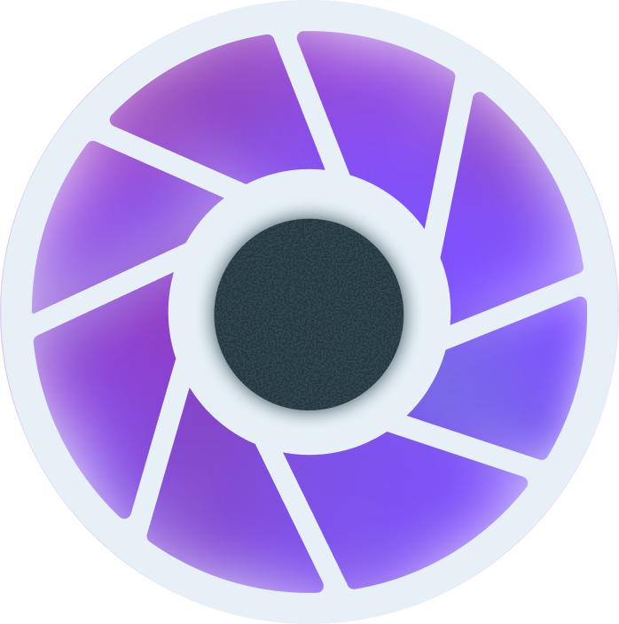

# Camposer

<p align="center">
 
</p>
<p align="center">
  <a href="https://search.maven.org/search?q=g:%22io.github.ujizin%22%20AND%20a:%22camposer%22">
  </a>
  
   <br/>
  <a href="https://androidweekly.net/issues/issue-546"></a>
</p>

<p align="center">📸 A Compose Multiplatform camera library for taking photos, recording videos, controlling flash/torch, zooming, and more.</p>
<br>
<p align="center">
 
</p>

<p align="center"><small>✨ Check out the <a href="https://github.com/ujizin/Camposer/tree/main/samples">sample projects</a></small></p>

## 🚀 Quick Start

Add the dependencies to your module `build.gradle.kts`, then sync your project:

```kotlin
// Android
dependencies {
  implementation("io.github.ujizin:camposer:<version>")
}

// Kotlin Multiplatform
sourceSets {
  commonMain.dependencies {
    implementation("io.github.ujizin:camposer:<version>")
    // Required when you want to use code analysis features (e.g., QR code scanning).
    implementation("io.github.ujizin:camposer-code-scanner:<version>")
  }
}

```

### 🧩 Basic Usage

To show the `CameraPreview` composable, use the example below:

```kotlin
val controller = remember { CameraController() }
val cameraSession = rememberCameraSession(controller)
var camSelector by remember { mutableStateOf(CamSelector.Back) }
CameraPreview(
  cameraSession = cameraSession,
  camSelector = camSelector,
) {
  // Camera Preview UI
}
```

## ✨ Features

- 📸 Take pictures
- 🎥 Record videos
- 🔍 Zoom
- 🎯 Focus support (tap to focus)
- ⚡ Flash mode
- 🔦 Torch
- 🎛️ Exposure compensation
- 🖼️ Image/video quality controls
- 🔭 Multi-camera lens support (Ultra-wide, Wide & Telephoto)
- ⏱️ 30/60 FPS video recording
- 🎬 Video stabilization (iOS only for now)
- 🧠 Image analyzer (code scanner)

## 📚 Documentation

Visit the docs to learn more: [ujizin.github.io/Camposer](https://ujizin.github.io/Camposer)

## 🛠️ Usage Examples

### 📸 Taking Pictures

Use `CameraSession` and call `takePicture`:

```kotlin
// Capture into a temporary byte array
cameraSession.takePicture { result ->
  /* ... */
}

// Capture into a file
cameraSession.takePicture(fileName) { result -> /* ... */ }
```

### 🎥 Recording Videos

Set `captureMode = CaptureMode.Video` in `CameraPreview`, then call `startRecording` and `stopRecording`.

```kotlin
cameraSession.startRecording(fileName) { result ->
  /* ... */
}
cameraSession.stopRecording()
```

### 🔄 Switching Cameras

To switch cameras, pass `camSelector` to `CameraPreview` (as shown above) and update its state.

```kotlin
// Front camera
camSelector = CamSelector.Front

// Back camera
camSelector = CamSelector.Back

// Toggle camera selector
camSelector = camSelector.inverse
```

### ➕ More

To explore additional features, check the [documentation](https://ujizin.github.io/Camposer).

Have `fun code()`! 👨‍💻

## ✨ Inspiration

Camposer includes features inspired by [react-native-vision-camera](https://github.com/mrousavy/react-native-vision-camera).

## 📄 License

```
Copyright 2022 ujizin (Lucas Yuji) 

Licensed under the Apache License, Version 2.0 (the "License");
you may not use this file except in compliance with the License.
You may obtain a copy of the License at

   http://www.apache.org/licenses/LICENSE-2.0

Unless required by applicable law or agreed to in writing, software
distributed under the License is distributed on an "AS IS" BASIS,
WITHOUT WARRANTIES OR CONDITIONS OF ANY KIND, either express or implied.
See the License for the specific language governing permissions and
limitations under the License.
```
