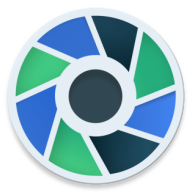

# Camposer

<p align="center">
 
</p>
<p align="center">
  <a href="https://opensource.org/licenses/Apache-2.0"></a>
  
  
  <a href="https://android-arsenal.com/api?level=23"></a>
  <a href="https://github.com/ujizin"></a>
  <a href="https://medium.com/@lucasyujideveloper/camposer-camera-library-using-jetpack-compose-for-android-3af63220fa00"></a>
  <a href="https://ujizin.github.io/Camposer/"></a></br>
  <a href="https://androidweekly.net/issues/issue-546"></a>
</p>

<p align="center">Tired to use a camera in Jetpack Compose with interoperability? Then Camposer was made for you. <br> A camera library totally in Jetpack Compose which supports taking photos, recording videos, flash modes, zoom ratio, and among others!</p>
<br>
<p align="center">
 
</p>

<p align="center"><small>Check out the <a href="https://github.com/ujizin/Camposer/tree/main/sample">Sample project</a></small></p>


## Gradle

<a href="https://search.maven.org/search?q=g:%22io.github.ujizin%22%20AND%20a:%22camposer%22"></a>

Add dependency to your `build.gradle` and sync your project

```
implementation 'io.github.ujizin:camposer:<version>'
```

## How to use

To add `CameraPreview` composable, just use the example below:

```Kotlin
val controller = remember { CameraController() }
val cameraSession = rememberCameraSession(controller)
var camSelector by remember { mutableStateOf(CamSelector.Back) }
CameraPreview(
  cameraSession = cameraSession,
  camSelector = camSelector,
) {
  // Camera Preview UI
}
```

### Taking pictures

To take picture use `CameraSession` and call `takePicture` method from it.

```Kotlin
// Using content values
cameraSession.takePicture(contentValues, mediaURI) { result ->
  /* ... */
}

// Using files
cameraSession.takePicture(file) { result -> /* ... */ }
```

### Recording videos

Change the capture mode for `CaptureMode.Video` on `CameraPreview` and call `toggleRecording` method twice for stop recording, or use `startRecording` and `stopRecording` separately

```Kotlin
// Using content values
cameraSession.startRecording()
cameraSession.stopRecording(contentValues, mediaURI) { result ->
  /* ... */
}

// Using file
cameraSession.startRecording()
cameraSession.stopRecording(file) { result -> /* ... */ }

// Using content values + toggle
cameraSession.toggleRecording(contentValues, mediaURI) { result ->
  /* ... */
}

// Using files + toggle
cameraSession.toggleRecording(file) { result -> /* ... */ }
```

### Switch cameras

To switch cameras, you have to add `camSelector` to your `CameraPreview` composable, as shown previously, after implementation, just need to change its state.

```Kotlin
// Use front camera
camSelector = CamSelector.Front

// Use back camera
camSelector = CamSelector.Back

// Inverse camera selector
camSelector = camSelector.inverse
```

###  Other configurations

If you want to use other configurations, you can see our [wiki](https://github.com/DevLucasYuji/Camposer/wiki).

Have a `fun code()`!

##  License

```
Copyright 2022 ujizin (Lucas Yuji) 

Licensed under the Apache License, Version 2.0 (the "License");
you may not use this file except in compliance with the License.
You may obtain a copy of the License at

   http://www.apache.org/licenses/LICENSE-2.0

Unless required by applicable law or agreed to in writing, software
distributed under the License is distributed on an "AS IS" BASIS,
WITHOUT WARRANTIES OR CONDITIONS OF ANY KIND, either express or implied.
See the License for the specific language governing permissions and
limitations under the License.
```
