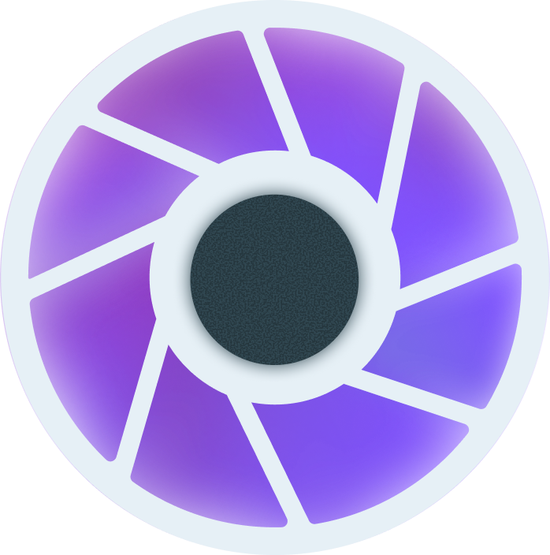

# Overview

    

A Kotlin Multiplatform camera library fully built in Jetpack Compose, supporting photo capture, video recording, flash modes, zoom ratios, and more!

## Platform Support

Camposer is compatible with the following platforms:

- Android
- iOS

## Features

- [Camera Selector](./camera-selector.md)
- [Capture Mode](./camera-capture-mode.md)
- [Camera Controller](./camera-controller/camera-controller.md)
    - [Taking Picture](./camera-controller/take-picture.md)
    - [Record Video](./camera-controller/record-video.md)
- [Camera Format (Resolution, FPS, Video stabilization)](./camera-format.md)
- [Mirror Mode](./mirror-mode.md)
- [Orientation Strategy](./orientation-strategy.md)
- [Image Capture Strategy](./image-capture-strategy.md)
- [Focus on Tap](./focus-on-tap.md)
- [Zoom](./zoom.md)
- [Flash Mode & Torch](./flash-mode.md)
- [Exposure compensation](./exposure-compensation.md)
- [Code Analyzer](./image-analyzer/code-analyzer.md)
- [Image Analyzer](./image-analyzer/image-analyzer.md)
- [Implementation mode (only Android)](./implementation-mode.md)